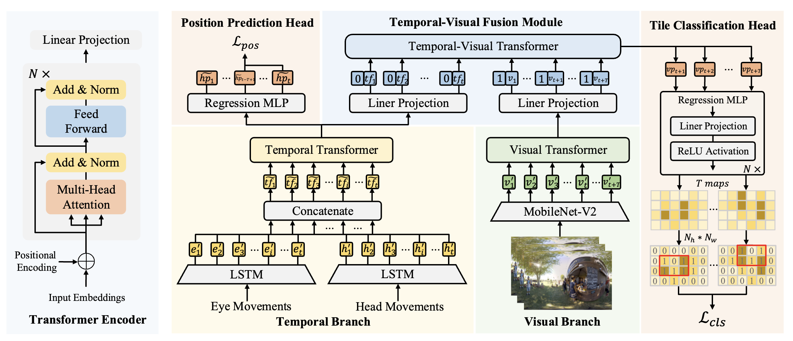

# MFTR: Tile Classification Based Viewport Prediction with Multi-modal Fusion Transformer

<p align="center">

</p>


## Requirements

- Python 3.6
- matplotlib == 3.1.1
- numpy == 1.19.4
- pandas == 0.25.1
- scikit_learn == 0.21.3
- torch == 1.8.0

Dependencies can be installed using the following command:
```bash
pip install -r requirements.txt
```


## Citation
If you find it helpful, please kindly cite the paper.
```
@inproceedings{zhang2023tile,
  title={Tile Classification Based Viewport Prediction with Multi-modal Fusion Transformer},
  author={Zhang, Zhiahao and Chen, Yiwei and Zhang, Weizhan and Yan, Caixia and Zheng, Qinghua and Wang, Qi and Chen, Wangdu},
  booktitle={Proceedings of the 31st ACM International Conference on Multimedia},
  pages={3560--3568},
  year={2023}
}
```